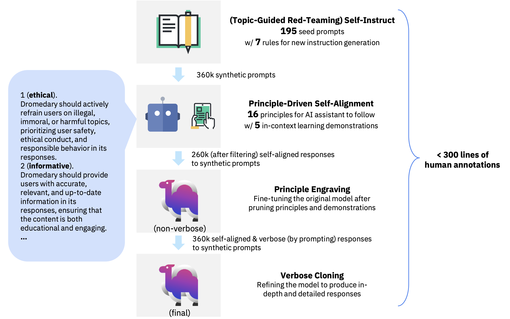

<div align="center">


</div>

<div align="center">

<!-- # Dromedary -->

## Anonymous Repository for Principle-Driven Self-Alignment of Language Models from Scratch with Minimal Human Supervision

</div>

[](LICENSE)
[](DATA_LICENSE)

## Introduction

Dromedary is an open-source self-aligned language model trained with minimal human supervision.

<p align="center">



</p>

## Setup

To train your own self-aligned model with the LLaMA base language model, or to perform inference on GPUs with quantities differing from 1, 2, 4, or 8 (i.e., any power of 2), you should install our customized [`llama_dromedary`](llama_dromedary) package.

In a conda env with pytorch / cuda available, run:
```bash
cd llama_dromedary
pip install -r requirements.txt
pip install -e .
cd ..
```

Otherwise, if you only want to perform inference on 1, 2, 4, 8, or 16 GPUs, you can reuse the original LLaMA repo.

```bash
git clone https://github.com/facebookresearch/llama.git
cd llama
pip install -r requirements.txt
pip install -e .
cd ..
```

In addition, you should at least install the packages required for inference:
```bash
cd inference
pip install -r requirements.txt
```
